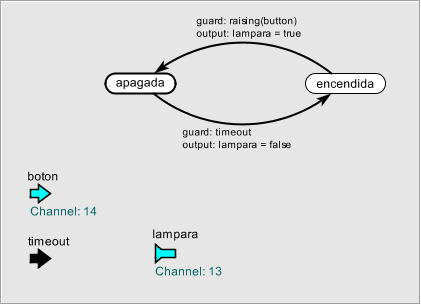
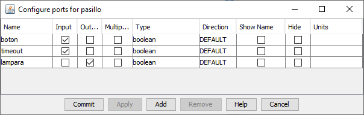

# Generación automática de FSM

Este repositorio es un ejemplo de uso de la generación automática de código C++ a partir de máquinas de estado especificadas con [Ptolemy II](https://ptolemy.berkeley.edu/ptolemyII/index.htm).

Se utiliza una serie de convenios para dirigir la generación automática. Así, por ejemplo, es posible indicar si una entrada o salida corresponde a un pin digital y en ese caso realiza *debouncing* automático.

## Prerrequisitos

Es necesario tener `python` instalado y accesible desde la ruta del sistema.  También es necesario instalar el paquete python `lxml`.

* Si usas la distribución estándar de python ejecuta en un terminal de órdenes lo siguiente.

```
python -m pip install lxml
```

* Si usas Anaconda ejecuta en un terminal de órdenes del entorno que se utilice (por defecto el entorno base) lo siguiente.

```
conda install lxml
```

## Estructura del ejemplo

El proyecto es un esqueleto de la práctica de la asignatura para el curso 2022/2023. La estructura es la siguiente:

```
├── CMakeLists.txt
├── model
│   ├── timer.xml
│   └── ...
├── main
│   ├── CMakeLists.txt
│   ├── fsm.hh                Implementación genérica de máquinas de estado en C++
│   ├── fsm.cc                Implementación genérica de máquinas de estado en C++
│   └── main.cc               Ejemplo de programa principal
├── script
│   ├── pt2cpp.py             Transforma XML de Ptolemy II en C++
│   └── pt2cpp.xsl            Transformaciones XSL utilizada por el script anterior
├── generated                 Archivos generados automáticamente
│   ├── timer.hh              Implementación de la FSM descrita en model/timer.xml
│   └── ...
└── README.md                 Este archivo
```

El archivo `CMakeLists.txt` de la carpeta principal contiene instrucciones para generar automáticamente el código C++ para todas las máquinas guardadas en la carpeta `model`.  Aunque solo se muestra como ejemplo `timer.xml` este proyecto está diseñado para tres máquinas de estado, que deberían encontrarse en la carpeta `model`:

* `timer.xml` es una máquina de estado con una única entrada GPIO `boton` y dos salidas `timeout1s` y `timeout10s`.  Activa la salida `timeout1s` cuando pasan `TO1S` iteraciones de la máquina de estados sin que se active el `boton`. Activa la salida `timeout10s` cuando pasan `TO10S` iteraciones de la máquina de estados sin que se active el `boton`.
* `codigo.xml` es una máquina de estados con tres entradas, una entrada GPIO `boton`, y dos entradas `timeout1s` y `timeout10s`.  Solo tiene una salida `codigo_correcto`, que se activa cuando el usuario introduce el código correcto con el método que indica el enunciado de la práctica.
* `alarma.xml` es una máquina de estados con una entrada GPIO `pir`y otra entrada `codigo_correcto` y dos salidas GPIO `led` y `buzzer`. Tiene dos estados, `armada` y `desarmada`. Inicialmente empieza en `desarmada`, que es un estado pasivo. Cuando recibe un evento `codigo_correcto` pasa a `armada` y activa el `led`. Mientras está en `armada` siempre que se detecte la activación de `pir` activará el `buzzer`. Si recibe `codigo_correcto` pasa a `desarmada`y desactiva el `buzzer`.

## Compilación

El proyecto se compila igual que cualquier proyecto de ESP-IDF. En la primera fase de compilación se generarán las máquinas de estado correspondientes a todos los archivos XML presentes en la carpeta `model`.

## Implementando una máquina de estados

Para ilustrar el funcionamiento de la biblioteca veremos un ejemplo de FSM editado en Ptolemy Vergil. Crea una FSM como la siguiente figura:



Debes prestar atención a las siguientes características:

* Las entradas y salidas que no son GPIO deben ponerse como puertos de entrada y salida respectivamente, en la barra de herramientas. Es necesario configurar el tipo de los puertos haciendo click con el botón derecho en el lienzo y pinchando en *Customize → Ports*. Ten en cuenta que el tipo `[boolean]` es *array de booleanos*. Si lo que quieres es una entrada booleana debes seleccionar el tipo `boolean`.



* Las entradas y salidas GPIO corresponden a `SubscriberPort` y `PublisherPort` de la carpeta `Ports`. Eso permite editar el *Channel* que corresponde al pin asociado.

* Se pueden añadir funciones auxiliares o incluso tipos auxiliares a la clase generada simplemente escribiéndolos en una `Annotation` en la carpeta *Decorative*.

* Guarda el modelo en la carpeta `model` con cualquier nombre en minúsculas, por ejemplo, `pasillo.xml`.

## La clase generada

El archivo generado comienza con un par de directivas *include* y a continuación:

``` C++
enum class Pasillo { APAGADA, ENCENDIDA };
```

Esto declara los estados posibles de la máquina de estados. Fíjate que se declara como una *enum class* para que los posibles valores sean `Pasillo::APGADA` y `Pasillo::ENCENDIDA`. Esto previene colisiones de nombres en otras máquinas de estado.

A continuación viene la declaración de la clase, que es un poco peculiar:

``` C++
class pasillo : public fsm<Pasillo, pasillo> {
    // ...
};
```

La clase `pasillo` es una clase derivada de la plantilla `fsm`. La peculiaridad reside en que la plantilla `fsm` recibe como parámetros de plantilla, entre otros, la propia clase `pasillo`. Esto se denomina CRTP (*curiously recurring template pattern*) y es una forma muy útil de inyectar comportamiento específico en una clase genérica. Tienes algo de información en la [Wikipedia](https://en.wikipedia.org/wiki/Curiously_recurring_template_pattern). El autor original (James O. Coplien) lo describe con mucho más detalle en su libro *Advanced C++: Styles and idioms*.

Pero sigamos con la implementación de la clase:

``` C++
    const gpio_num_t BOTON = GPIO_NUM_14;
    const gpio_num_t LAMPARA = GPIO_NUM_13;
```

Esto simplemente declara constantes para los pines que utilizaremos. Cambia en la propiedad *Channel* de los puertos el número si lo deseas.

Lo siguiente ya sí tiene más interés:

``` C++
public:
    gpio_input boton;
    input<bool> timeout;

public:
    gpio_output lampara;
```

Fíjate que los GPIO se declaran de forma diferente a las entradas normales.  Las entradas GPIO tienen tipo implícito (*bool*) y debouncing automático. También se configuran automáticamente y se activa un *pulldown*, es decir, son activas a nivel alto.

Las entradas son instancias de la plantilla `input` que recibe el tipo de entrada como parámetro.  Todas las entradas (también las GPIO) mantienen el valor previo para detectar flancos con las funciones `raising` y `falling`.  Se pueden detectar flancos en entradas no binarias, pero simplemente indica cambio de valor creciente o decreciente.

Las salidas son instancias de la plantilla `output`, que es prácticamente simétrica a `input`. Sin embargo las salidas no guardan valores previos, por lo que no es posible detectar flancos con `raising` o `falling`.

Las entradas que no son GPIO tienen que conectarse a algo. Hemos asumido que las entradas se conectan a una salida de otra FSM.  Para ello se genera automáticamente una referencia a la salida que se va a conectar a cada entrada. Fíjate que se guarda como `const` para no poder manipularla y que tiene el mismo nombre que la entrada pero precedido por un carácter subrayado.

``` C++
protected:
    const output<bool>& _timeout;
```

## El constructor

El constructor especifica la tabla de transiciones y a continuación la inicialización de todos los miembros que hemos descrito (entradas, salidas, GPIO, referencias a las salidas que se conectan con las entradas, etc.).  Veamos el aspecto completo y luego lo describiremos paso a paso.

``` C++
public:
    pasillo(const output<bool>& ext_timeout) : fsm_type {
        transition{
            Pasillo::APAGADA, [this](){ return timeout; },
            Pasillo::ENCENDIDA, [this](){ lampara = false; ; }
        },
        transition{
            Pasillo::ENCENDIDA, [this](){ return raising(button); },
            Pasillo::APAGADA, [this](){ lampara = true; ; }
        },
    },
    boton{BOTON},
    timeout{[this](){ return _timeout; }},
    lampara{LAMPARA},
    _timeout{ext_timeout}
    {}
```

La tabla de transiciones se pone como una secuencia de objetos `transition` con cuatro elementos, el estado origen, la función de guarda, el estado destino y la función de salida.

``` C++
transition{
            Pasillo::APAGADA, [this](){ return timeout; },
            Pasillo::ENCENDIDA, [this](){ lampara = false; ; }
        },
```

La función de guarda debe ser un objeto funcional sin argumentos que devuelve un valor de tipo `bool`.  Lo normal es utilizar *funciones lambda*. Fíjate que si en las funciones lambda capturas el puntero `this` puedes usar todos los campos de la clase como si fuera un método.

Las entradas y salidas GPIO se inician con el valor de su número de pin:

``` C++
    boton{BOTON},
    // ...
    lampara{LAMPARA},
```

Las entradas que no son GPIO se configuran de manera que por defecto lean el valor de la salida conectada:

``` C++
    timeout{[this](){ return _timeout; }},
```

Y las referencias a las salidas que se conectan a las entradas se inicializan con un parámetro extra del constructor:

``` C++
public:
    pasillo(const output<bool>& ext_timeout) :
    // ...
    _timeout{ext_timeout}
```

## Programa principal

Con esto ya podemos usar la clase en el programa principal.  Instanciamos un temporizador, que tiene al menos una salida booleana para conectar a la entrada `timeout`.  Instanciamos un `pasillo` pasando la salida del temporizador al constructor. Y finalmente hacemos composición síncrona de las dos máquinas de estado.

``` C++
#include <freertos/FreeRTOS.h>
#include <freertos/task.h>
#include "timer.hh"
#include "pasillo.hh"

extern "C" void app_main();
void app_main(void)
{
    timer t;
    pasillo p{t.timeout10s};
    fsm_composite fsm{t,p};
    
    TickType_t last = xTaskGetTickCount();
    for(;;) {
        fsm.iteration();
        xTaskDelayUntil(&last, 200/portTICK_PERIOD_MS); // periodo 200ms
    }
}
```

La composición síncrona permite que todas las entradas se capturen antes de llamar a los `update` de las máquinas de estado, luego se llama a los `update` y finalmente se llama a las funciones para generar las salidas.  Esto garantiza las condiciones que permiten asumir la *hipótesis síncrona*, que es la base del análisis formal que haremos con **nuXmv**.

## Modos alternativos de especificación

Estamos experimentando con el uso de Vergil como herramienta de especificación y todavía no hemos llegado a una solución enteramente satisfactoria. Existen formas alternativas para especificar las variables de estado que pueden tener ventajas frente a lo que se explica arriba.

Las variables de estado normales pueden especificarse también como puertos de entrada y salida, de la barra de herramientas.  Eso permite especificar el tipo de datos como en el resto de los puertos. La desventaja es que el valor por defecto, el que se usa en el momento de la construcción, no se muestra en el diagrama.

Los parámetros externos para el constructor, que al final se comportan igual que las variables de estado, pueden especificarse como *Ports → PortParameter*.  Al igual que en el caso anterior, puede especificarse el tipo como en cualquier puerto.
